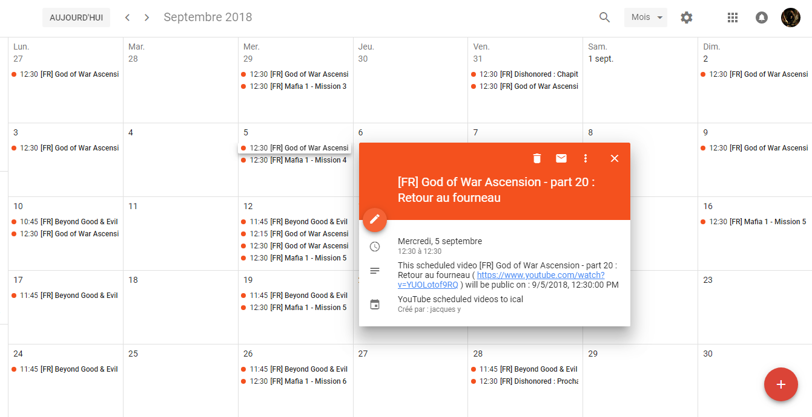
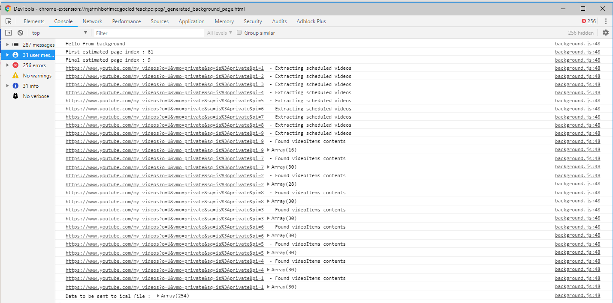
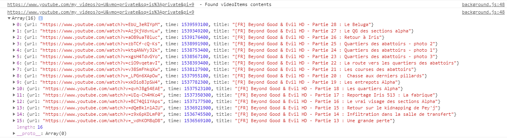

# YouTube scheduled videos to ical

Extract your scheduled videos publish date to a ical file so that it allows you to to see your scheduling in your favorite calendar app



## How does it works

Simply scraping data on the Youtube Creator pages (Not the beta/new one) because the Youtube Data V3 API doesn't provide data easily ^^

A typical execution does something like that :


Data on each page is collected :


```
fields:
    url: The url where you can see this video
    time: That is a long date timestamp (UNIX) , conversion is done by new Date(time * 1000)
    title: The title you choose for this video
```

## Install

	$ npm install

## Development

    npm run dev chrome
    npm run dev firefox
    npm run dev opera
    npm run dev edge

## Build

    npm run build chrome
    npm run build firefox
    npm run build opera
    npm run build edge

## Environment

The build tool also defines a variable named `process.env.NODE_ENV` in your scripts. 

## Docs

* [webextension-toolbox](https://github.com/HaNdTriX/webextension-toolbox)

## Known Bugs

> Refused to execute inline event handler because it violates the following Content Security Policy directive: "script-src 'self' blob: filesystem:". Either the 'unsafe-inline' keyword, a hash ('sha256-...'), or a nonce ('nonce-...') is required to enable inline execution.

Problem related to CSP of whatever module build using Webpack. The extension works even if there is this message :)